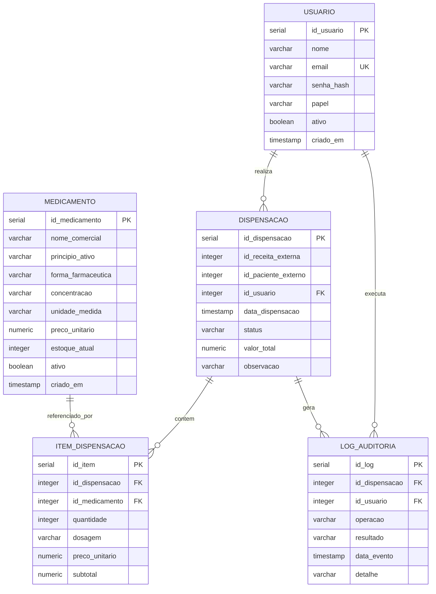

# Banco de Dados — G8 Farmácia

Módulo de Farmácia do Sistema de Saúde Integrado. Banco relacional em PostgreSQL.

## Arquivos

- `01_schema.sql` — criação das tabelas, chaves, constraints e índices
- `02_view_proc_trigger.sql` — view, stored procedure e trigger
- `03_seed.sql` — dados de exemplo para teste
- `diagrama_fisico.md` — diagrama físico (ER)

## Ordem de execução

```
psql -U postgres -d farmacia_g8 -f 01_schema.sql
psql -U postgres -d farmacia_g8 -f 02_view_proc_trigger.sql
psql -U postgres -d farmacia_g8 -f 03_seed.sql
```

## Diagrama Físico



## Decisões de modelagem

As receitas (G6) e pacientes (G1) pertencem a outros módulos. Por isso o banco guarda
apenas `id_receita_externa` e `id_paciente_externo` como referências numéricas, sem
chave estrangeira local — os dados completos são buscados via API. Isso também atende
à LGPD, já que dados pessoais não ficam duplicados aqui.

A normalização separa `dispensacao` (cabeçalho) de `item_dispensacao` (itens), evitando
repetição de dados e permitindo várias linhas de medicamento por dispensação (3FN).

## View

`vw_historico_dispensacao` junta dispensação, usuário, item e medicamento numa
consulta única, usada pela tela de histórico e pela auditoria.

## Stored Procedure

`sp_registrar_dispensacao` insere a dispensação e seu item dentro de uma única
transação, calcula o subtotal e grava o log. Se o medicamento não existir, lança erro
e desfaz tudo.

## Trigger

`tg_baixa_estoque` dispara após inserir um item e desconta a quantidade do estoque do
medicamento, barrando a operação se não houver saldo. Mantém o estoque sempre
consistente, independente de quem inseriu o item.
